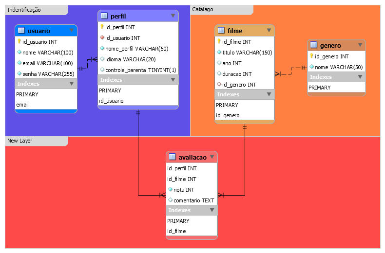

# 🎬API FILMES🎥
## 1) O que é uma API? (explicação simples para os alunos)

* **API (Application Programming Interface)** é um contrato que permite que sistemas diferentes conversem entre si.
* Em termos web, uma **API REST** expõe endpoints (URLs) que recebem requisições HTTP (GET, POST, PUT, DELETE) e retornam respostas (JSON, XML, etc.).
* **Para que serve:** integrar front-end com back-end, permitir que apps e serviços consumam dados (ex.: um app de celular consumindo lista de filmes), testar funcionalidades sem interface gráfica e padronizar comunicação.

**Exemplo didático:** A **API Filmes** expõe rotas para listar filmes, buscar por ID, criar, atualizar e deletar — funciona como um catálogo programático de filmes que qualquer cliente pode consultar.

---

## 2) Relacionamento com o DER (modelo de dados)

Antes de documentar a API, é importante entender o **modelo de dados** (DER). O DER mostra as tabelas (models) e seus relacionamentos — por exemplo, `Filme` e `Genero`.

 

---

## 3) Por que documentar a API com OpenAPI/Swagger?

* Gera documentação legível e interativa (Swagger UI / Editor).
* Facilita o entendimento do contrato da API (endpoints, parâmetros, modelos de dados).
* Permite testar endpoints diretamente no navegador (quando a API estiver rodando localmente).
* Ajuda a manter consistência entre front-end e back-end e é um excelente item para o TCC.

---

## 4) Estrutura do arquivo OpenAPI (o que cada bloco significa e por que a ordem importa)

Ao escrever um documento OpenAPI/Swagger, seguimos uma ordem lógica que facilita leitura e manutenção. Abaixo a explicação de cada bloco (em ordem):

1. **`openapi`**

   * Declara a versão do spec (ex.: "3.0.0").
   * Importante porque ferramentas (Swagger Editor/UI) interpretam a spec a partir daí.

2. **`info`**

   * Metadados sobre a API: `title`, `version`, `description`.
   * Deve vir cedo para identificação rápida do projeto.

3. **`servers`**

   * Define a base URL (ex.: `http://localhost:3000/api/v1`).
   * Útil para o ambiente de desenvolvimento e testes. Swagger UI usa isso como prefixo.

4. **`paths`**

   * Lista os endpoints HTTP (ex.: `/filmes`, `/filmes/{id}`).
   * Cada caminho contém métodos (GET, POST, PUT, DELETE) e descreve parâmetros, requestBody e responses.
   * Colocar `paths` antes de `components` é comum na leitura, mas **`components`** contém reutilizáveis que as `paths` referenciam (por isso a presença de `$ref` nas `paths`).

5. **`components`** (schemas, examples, responses reutilizáveis)

   * Define modelos de dados (`schemas`) que serão referenciados por `$ref` dentro das `paths`.
   * Mantém a spec DRY (Don't Repeat Yourself): você define `Filme` uma vez e reutiliza em várias respostas/requests.

6. **Exemplos e respostas**

   * Colocar exemplos nos `requestBody` e `responses` ajuda muito nos testes e na compreensão.

**Por que esta ordem?**

* A ordem facilita a leitura: metadados, onde a API está (servers), o que ela faz (paths) e quais são os modelos (components). Mesmo que a spec aceite outra ordem tecnicamente, seguir esta convenção torna o arquivo mais compreensível para humanos e ferramentas.

---

## 5) Passo a passo que os alunos devem digitar (guia para a aula)

### Passo 0 — Preparação

* Abra o **VS Code** (ou editor preferido).
* Crie a pasta do projeto: `API-Filmes-Docs`.
* Dentro dela crie `index.html` (Swagger Editor/UI local) e o arquivo de definição `filmes.json`.
* Se for usar a imagem do DER, coloque `ERD.svg` na mesma pasta.

### Passo 1 — Esqueleto inicial

Digite no `filmes.json`:

```json
{
  "openapi": "3.0.0",
  "info": {
    "title": "API de Filmes",
    "version": "1.0.0",
    "description": "Documentação inicial da API de Filmes."
  },
  "servers": [
    { "url": "http://localhost:3000/api/v1", "description": "Servidor local" }
  ],
  "paths": {}
}
```

**Por que começar por aqui?** É o mínimo que uma spec precisa para ser válida: versão do spec, informações sobre a API, e a base para incluir endpoints (`paths`).

### Passo 2 — Endpoint GET /filmes (listar)

Adicione ao `paths`:

```json
"/filmes": {
  "get": {
    "summary": "Lista todos os filmes",
    "description": "Retorna todos os filmes cadastrados.",
    "responses": {
      "200": { "description": "Lista de filmes retornada com sucesso" }
    }
  }
}
```

**Por que primeiro o GET?** Porque é o endpoint mais simples e sem corpo (body), ideal para entender a estrutura de `paths` e `responses`.

### Passo 3 — Path param: GET /filmes/{id}

Adicione:

```json
"/filmes/{id}": {
  "get": {
    "summary": "Busca filme por ID",
    "parameters": [
      { "name": "id", "in": "path", "required": true, "schema": { "type": "integer" }, "description": "ID do filme" }
    ],
    "responses": {
      "200": { "description": "Filme encontrado" },
      "404": { "description": "Filme não encontrado" }
    }
  }
}
```

**Por que depois do GET simples?** Introduz parâmetros de rota (path parameters) — um conceito importante antes de lidar com `requestBody`.

### Passo 4 — POST /filmes (requestBody)

Adicione o POST no `/filmes`:

```json
"post": {
  "summary": "Adiciona um novo filme",
  "requestBody": {
    "required": true,
    "content": {
      "application/json": {
        "schema": {
          "type": "object",
          "properties": {
            "titulo": { "type": "string" },
            "ano": { "type": "integer" },
            "duracao": { "type": "integer" },
            "generoId": { "type": "integer" }
          },
          "required": ["titulo", "ano", "generoId"]
        }
      }
    }
  },
  "responses": { "201": { "description": "Filme criado com sucesso" } }
}
```

**Por que aqui?** POST exige um corpo com um `schema`. É natural apresentá-lo depois que os alunos entenderem endpoints e parâmetros.

### Passo 5 — PUT e DELETE (alterar e remover)

No `paths` `/filmes/{id}` adicione PUT e DELETE. Explique que PUT também usa `requestBody` (semelhante ao POST) e DELETE normalmente não precisa de `requestBody`, apenas `id` na URL.

**Por que nessa ordem?** Primeiro CRUD (Read), depois Create, depois Update/Delete — segue a lógica de aprendizado: observar os dados, criar novo, modificar e apagar.

### Passo 6 — Busca por gênero (filtros)

Adicione `/filmes-genero/{genero}` com parâmetro `genero` (string) e explique quando usar filtros via path vs query params (ex.: `?genero=Fantasia` como alternativa usando query params).

---

## 6) `components.schemas` — modelos reutilizáveis

Explique que modelos (Filme, FilmeInput) devem ser definidos em `components.schemas` e referenciados nas `paths` com `$ref`.

**Exemplo:**

```json
"components": {
  "schemas": {
    "Filme": {
      "type": "object",
      "properties": {
        "id": { "type": "integer" },
        "titulo": { "type": "string" },
        "ano": { "type": "integer" },
        "duracao": { "type": "integer" },
        "generoId": { "type": "integer" }
      },
      "required": ["id", "titulo", "ano"]
    }
  }
}
```

**Por que usar `components`?** Evita repetição e mantém a documentação consistente. Se você mudar um campo do modelo, atualiza uma vez só.

---

